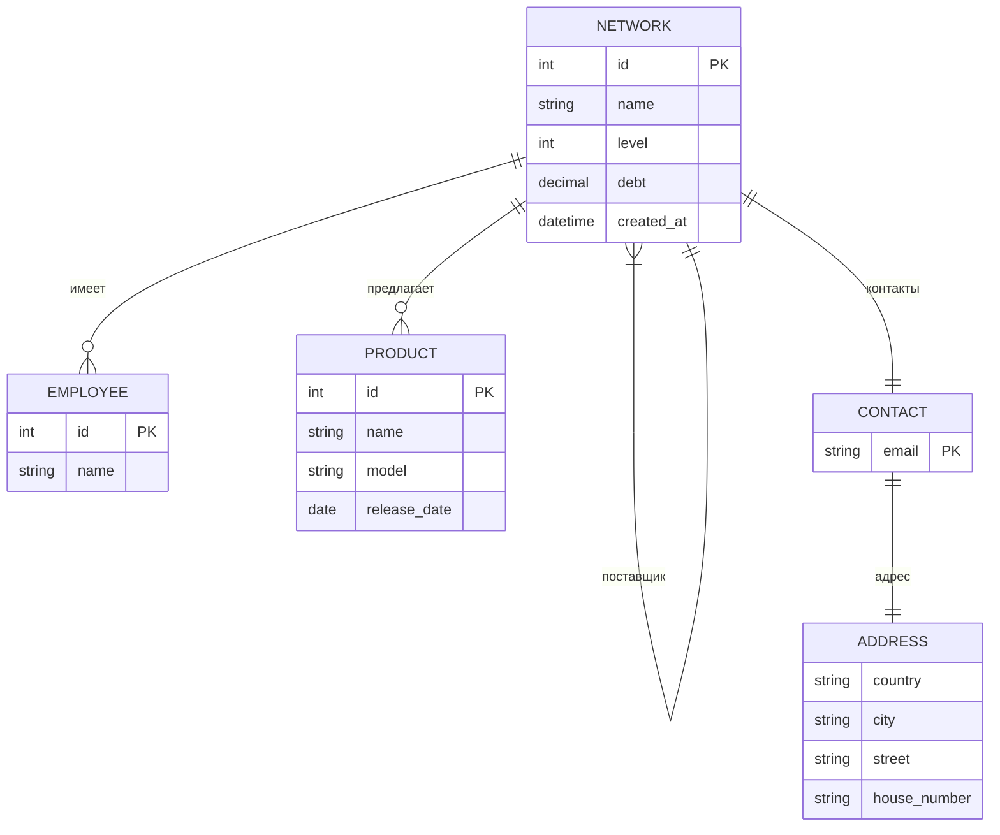

# ROCKETDATA: Электронная торговая сеть

## Описание проекта

Django REST API для управления многоуровневой сетью электронной коммерции с отслеживанием задолженностей между участниками.

## Основные функции

- **Иерархическая структура**: Заводы → Дистрибьюторы → Дилеры → Розничные сети
- **Управление продуктами**: Модели и даты выпуска
- **Контроль задолженностей**: Финансовые обязательства между участниками
- **Система контактов**: Адреса и электронная почта
- **Управление сотрудниками**: Привязка к конкретным участкам сети

## API Эндпоинты

### Основные
| Метод | Endpoint | Описание |
|-------|----------|----------|
| GET | `/api/networks/` | Список всех участников сети |
| POST | `/api/networks/` | Создание нового участника сети |
| GET | `/api/networks/<id>/` | Детали конкретного участника сети |
| PUT | `/api/networks/<id>/` | Обновление данных конкретного участника сети |
| DEL | `/api/networks/<id>/` | Удаление конкретного участника сети |
| GET | `/api/products/` | Список всех продуктов |
| POST | `/api/products/` | Создание нового продукта |
| GET | `/api/products/<id>/` | Детали конкретного продукта |
| PUT | `/api/products/<id>/` | Обновление данных конкретного продукта |
| DEL | `/api/products/<id>/` | Удаление конкретного продукта |

### Специальные
| Метод | Endpoint | Описание |
|-------|----------|----------|
| GET | `/api/networks/debt_statistics/` | Статистика по задолженностям |
| GET | `/api/networks/?contact__address__country=Молдова` | Фильтр по стране |
| GET | `/api/networks/?product_id=3` | Фильтр по продукту |

## Аутентификация через CSRF Token

### 1. Получение CSRF Token
```bash
curl -X GET http://127.0.0.1:8000/api/networks/ \
--cookie-jar cookies.txt
```
Из файла cookies.txt или заголовков ответа получите:
- `csrftoken`
- `sessionid`

### 2. Пример запроса с аутентификацией
```bash
curl -X POST http://127.0.0.1:8000/api/networks/ \
-H "X-CSRFToken: ваш_csrf_токен" \
-H "Content-Type: application/json" \
-H "Cookie: csrftoken=ваш_csrf_токен; sessionid=ваш_session_id" \
-d '{
    "name": "Новая сеть",
    "level": 1,
    "contact": 1,
    "products": [1, 2]
}'
```

### 3. Использование в Postman
1. Сначала выполните GET-запрос для получения куки
2. В настройках Postman:
   - Вкладка "Headers":
     ```
     X-CSRFToken: <ваш_токен>
     Content-Type: application/json
     ```
   - Вкладка "Cookies":
     ```
     csrftoken=<ваш_токен>
     sessionid=<ваш_session_id>
     ```

## Важные замечания
1. Для production используйте JWT аутентификацию вместо CSRF
2. Все POST/PUT/PATCH запросы требуют CSRF токен
3. GET запросы доступны без аутентификации

## Полный пример запроса создания сети
```bash
curl -X POST http://localhost:8000/api/networks/ \
-H "X-CSRFToken: UgSE3PPB1JYJVL8G1IhjYXfl9nYYCzqS" \
-H "Content-Type: application/json" \
-H "Cookie: csrftoken=UgSE3PPB1JYJVL8G1IhjYXfl9nYYCzqS; sessionid=xelxgz2ajsobh3zjytdg5qvwluefeif8" \
-d '{
    "name": "Новая сеть",
    "level": 1,
    "contact": 1,
    "products": [1, 2],
    "supplier": null
}'
```

## Структура данных



## Установка

1. Клонировать репозиторий:
```bash
git clone https://github.com/YuryHerasimau/ecommerce.git
cd ecommerce
```

2. Настроить окружение:
```bash
python -m venv venv
source venv/bin/activate  # Linux/Mac
venv\Scripts\activate    # Windows
pip install -r requirements.txt
```

3. Настроить базу данных:
```bash
python manage.py migrate
python manage.py createsuperuser
```

4. Запустить сервер:
```bash
python manage.py runserver
```

## Примеры запросов

**Создание участника сети**:
```bash
POST /api/networks/
{
    "name": "Электросити",
    "level": 3,
    "contact": 1,
    "products": [1, 2],
    "supplier": null
}
```

**Получение статистики**:
```bash
GET /api/networks/stats/debt/
{
    "average_debt": 1250.50,
    "count": 2,
    "networks": [
        {
            "id": 1,
            "name": "Электросити",
            "debt": "1500.00"
        }
    ]
}
```

## Фоновые задачи

Система использует Celery для выполнения фоновых задач:

1. **Увеличение задолженности**:
   - Автоматически каждые 3 часа
   - Случайное увеличение на 5-500 единиц

2. **Уменьшение задолженности**:
   - Ежедневно в 6:30
   - Случайное уменьшение на 100-10000 единиц

3. **Асинхронная очистка**:
   - При очистке >20 сетей через админку

Для работы требуется:
```bash
# Установка Redis
sudo apt-get install redis-server

# Запуск сервисов

```bash
# Терминал 1 - Redis:
redis-server
# Терминал 2 - Celery Worker:
celery -A ecommerce worker --loglevel=info [--pool=solo]
# Терминал 3 - Celery Beat (планировщик):
celery -A ecommerce beat --loglevel=info [--scheduler django_celery_beat.schedulers:DatabaseScheduler]
```

## Заполнение тестовыми данными

Для быстрого заполнения базы реалистичными тестовыми данными используется Faker и [Django Management Command](ecommerceapp\management\commands\seed_db.py)

Запустите команду:

```bash
python manage.py seed_db
```

Будут созданы:
- 15 контактов с адресами
- 20 продуктов
- 25 торговых сетей с иерархией поставщиков
- 50-125 сотрудников (по 2-5 на каждую сеть)

Для повторного заполнения сначала удалите старые данные:
```bash
python manage.py flush --noinput
python manage.py seed_db
```

## Запуск тестов

1. Активируйте виртуальное окружение
2. Запустите тесты:
```bash
python manage.py test ecommerceapp.tests
```

Тесты проверяют:
- Доступ без аутентификации (403)
- Создание новых сетей (201)
- Удаление продуктов (204)
- Доступ для неактивных пользователей (403)

## Интерфейс администратора

Доступ по адресу `http://localhost:8000/admin/` с учетными данными суперпользователя.

## Развертывание

Рекомендуемая production-конфигурация:
- PostgreSQL
- Gunicorn + Nginx
- Настройки в `.env`:

```ini
DJANGO_SECRET_KEY=ваш_секретный_ключ
DB_NAME=имя_бд
DB_USER=пользователь
DB_PASSWORD=пароль
DB_HOST=localhost
DB_PORT=5432
```

## Основные улучшения

1. Исправлены ошибки в моделях, сериализаторах и представлениях.
2. Добавлен специальный `NetworkDebtSerializer` для компактного вывода статистики
3. Добавлен подробный README файл
4. Добавлены тесты
